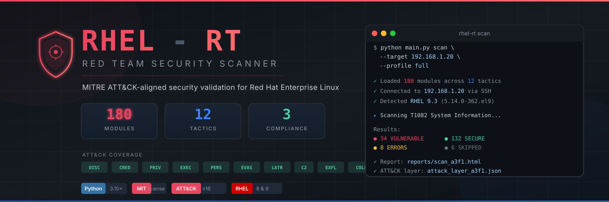

# RHEL-RT — Red Hat Enterprise Linux Red Teaming Tool

<p align="center">
  
</p>

An open-source Python-based active scanning tool for red team security testing on Red Hat Enterprise Linux, aligned with the [MITRE ATT&CK Framework (Linux Matrix)](https://attack.mitre.org/matrices/enterprise/linux/).

[](LICENSE)
[](https://python.org)
[](https://attack.mitre.org)

---

## Overview

RHEL-RT is a security validation and verification tool that systematically tests security controls on RHEL 8 and RHEL 9 systems. It maps every check to a specific MITRE ATT&CK technique, providing security teams with actionable insights and ATT&CK Navigator heatmaps.

### Key Features

- **108 modules implemented** across 9 ATT&CK tactics — Discovery, Credential Access, Privilege Escalation, Execution, Persistence, Defense Evasion, Lateral Movement, C2, Exfiltration
- **Safe by default** — passive, read-only checks; active simulation requires explicit `--simulate` flag
- **ATT&CK Navigator export** — JSON layers for visual heatmap analysis
- **Multi-format reporting** — HTML (dark-themed with per-technique detail pages), JSON, CSV
- **Compliance mapping** — CIS Controls v8, NIST SP 800-53 Rev. 5, CIS RHEL 9 Benchmark
- **Local & remote scanning** — direct execution or SSH (paramiko)
- **RHEL-specific controls** — SELinux, firewalld, auditd, PAM, FIPS, crypto policies, systemd sandboxing
- **Module auto-discovery** — drop a technique module into `modules/` and it's automatically loaded
- **Evidence chain** — every action logged with timestamp, target, technique ID, and result
- **CI/CD** — GitHub Actions pipeline with Python 3.10-3.12, ruff linting, mypy, pytest + coverage

---

## Quick Start

### Prerequisites

- Python 3.10+
- Target: RHEL 8 or RHEL 9 (local or remote via SSH)
- Proper authorization to test the target system

### Installation

```bash
git clone https://github.com/Krishcalin/RHEL-Red-Teaming.git
cd RHEL-Red-Teaming
pip install -r requirements.txt
```

### Usage

```bash
# Quick passive scan on localhost (check-only, safe)
python main.py scan --target localhost --profile quick

# Full scan against a remote host
python main.py scan --target 192.168.1.20 -u admin -k ~/.ssh/id_rsa --profile full

# Active simulation mode (requires explicit flag)
python main.py scan --target 192.168.1.20 -u admin --profile full --simulate

# Scan a specific tactic
python main.py scan --target localhost --tactic discovery

# Scan a specific technique
python main.py scan --target localhost --technique T1082

# Generate HTML report from a previous scan
python main.py report --input reports/scan_abc123_2026-03-19.json --format html

# List all available modules
python main.py list-modules

# List supported tactics
python main.py list-tactics
```

---

## Architecture

```
RHEL-Red-Teaming/
├── config/                     # YAML configuration
│   ├── settings.yaml           # Global settings (targets, credentials)
│   ├── techniques.yaml         # Enable/disable specific techniques
│   └── profiles/               # Scan profiles (quick, full, stealth)
├── core/                       # Core engine
│   ├── engine.py               # Orchestrator with module auto-discovery
│   ├── session.py              # Local + SSH session management
│   ├── models.py               # Data models (Target, Finding, ModuleResult)
│   ├── banner.py               # Professional ASCII banner
│   ├── logger.py               # Structured logging + evidence chain
│   ├── reporter.py             # Report generation (HTML/JSON/CSV)
│   ├── mitre_mapper.py         # ATT&CK Navigator JSON layer export
│   └── compliance.py           # CIS/NIST 800-53/CIS RHEL compliance mapping
├── modules/                    # Technique modules (one per ATT&CK technique)
│   ├── base.py                 # BaseModule abstract class
│   ├── discovery/              # TA0007 — 26 techniques
│   ├── credential_access/      # TA0006 — 15 techniques
│   ├── privilege_escalation/   # TA0004 — 12 techniques
│   ├── defense_evasion/        # TA0005 — 26 techniques
│   ├── persistence/            # TA0003 — 18 techniques
│   ├── execution/              # TA0002 — 10 techniques
│   ├── lateral_movement/       # TA0008 — 3 modules implemented
│   ├── command_and_control/    # TA0011 — 3 modules implemented
│   ├── exfiltration/           # TA0010 — 2 modules implemented
│   ├── collection/             # TA0009 — planned
│   ├── initial_access/         # TA0001 — planned
│   └── impact/                 # TA0040 — planned
├── templates/                  # Jinja2 HTML report template
├── tests/                      # pytest test suite
├── main.py                     # CLI entry point (click)
└── pyproject.toml              # Project metadata
```

### How It Works

1. **Engine** loads all technique modules from `modules/` via auto-discovery
2. **Session** connects to the target (local subprocess or SSH via paramiko)
3. Each **module** runs `check()` (passive) or `simulate()` (active) against the target
4. Results are collected as `ModuleResult` objects with `Finding` details
5. **Reporter** outputs HTML/JSON/CSV reports with compliance data
6. **MitreMapper** exports ATT&CK Navigator JSON layers for visual analysis
7. **ComplianceMapper** enriches results with CIS Controls, NIST 800-53, and CIS RHEL Benchmark refs

### Writing a Module

Every module inherits from `BaseModule` and implements four methods:

```python
from modules.base import BaseModule
from core.models import ModuleResult, Severity, Status, Tactic
from core.session import Session


class SystemInfoCheck(BaseModule):
    TECHNIQUE_ID = "T1082"
    TECHNIQUE_NAME = "System Information Discovery"
    TACTIC = Tactic.DISCOVERY
    SEVERITY = Severity.INFO
    SUPPORTED_OS = ["rhel8", "rhel9"]
    REQUIRES_ROOT = False
    SAFE_MODE = True

    def check(self, session: Session) -> ModuleResult:
        result = session.execute("uname -a")
        if result.success:
            self.add_finding(
                title="System information is accessible",
                description="Any user can enumerate system details",
                evidence=result.output,
                remediation="Restrict access via kernel parameters",
            )
            return self.make_result(Status.VULNERABLE, raw_output=result.output)
        return self.make_result(Status.NOT_VULNERABLE)

    def simulate(self, session: Session) -> ModuleResult:
        return self.check(session)  # Same as check for read-only modules

    def get_mitigations(self) -> list[str]:
        return [
            "Set kernel.dmesg_restrict = 1",
            "Restrict /proc visibility with hidepid=2",
        ]
```

Save as `modules/discovery/T1082_system_info.py` — the engine discovers it automatically.

---

## MITRE ATT&CK Coverage

| Tactic | ID | Techniques | Priority Checks |
|--------|----|-----------|-----------------|
| Initial Access | TA0001 | 10 | Valid accounts, public-facing app exploits, SSH exposure |
| Execution | TA0002 | 10 | Shell restrictions, cron/at/systemd, scripting interpreters |
| Persistence | TA0003 | 18 | Systemd services, cron, SSH keys, PAM, udev rules |
| Privilege Escalation | TA0004 | 12 | SUID/SGID, sudo misconfig, kernel CVEs, container escape |
| Defense Evasion | TA0005 | 26 | SELinux, auditd, rootkits, log tampering, masquerading |
| Credential Access | TA0006 | 15 | /etc/shadow, SSH keys, PAM, Kerberos, credential files |
| Discovery | TA0007 | 26 | System info, accounts, network, processes, services |
| Lateral Movement | TA0008 | 3 | SSH hardening, SMB/NFS, PtH/PtT, tool transfer |
| Command & Control | TA0011 | 3 | Egress filtering, DNS tunneling, encrypted channels, proxy |
| Exfiltration | TA0010 | 2 | DNS/ICMP exfil, C2 channel exfil, data staging, DLP |
| Collection | TA0009 | — | Planned |
| Initial Access | TA0001 | — | Planned |
| Impact | TA0040 | — | Planned |

**Implemented: 108 technique modules across 9 tactics**

---

## RHEL-Specific Security Controls

| Control | What We Test |
|---------|-------------|
| **SELinux** | Mode, policy, booleans, confined domains |
| **Firewalld / nftables** | Zones, ports, rich rules, direct rules |
| **auditd** | Rules, key events, log integrity, immutable flag |
| **PAM** | Module stack, faillock, password complexity |
| **FIPS mode** | Compliance status, crypto policies |
| **SSH hardening** | Ciphers, MACs, PermitRootLogin, key-only auth |
| **Sudo** | NOPASSWD, wildcard abuse, env_keep, secure_path |
| **SUID/SGID** | Binary audit vs CIS baseline |
| **Kernel hardening** | ASLR, ptrace_scope, dmesg_restrict, core dumps |
| **Systemd sandboxing** | ProtectSystem, NoNewPrivileges, service isolation |
| **Package integrity** | rpm -Va, GPG verification, repo signing |
| **Crypto policies** | TLS minimum version, allowed ciphers |
| **Container security** | Podman rootless, namespaces, seccomp profiles |

---

## Scan Profiles

| Profile | Tactics | Speed | Use Case |
|---------|---------|-------|----------|
| **quick** | Discovery, Credential Access, Privilege Escalation | Fast | Rapid assessment |
| **full** | All tactics | Thorough | Comprehensive audit |
| **stealth** | Discovery, Credential Access | Low-noise | Passive-only recon |

---

## Reports & Output

### HTML Report
Dark-themed, interactive HTML report with:
- Executive summary (total checks, vulnerable, secure, errors)
- Severity breakdown bar chart (critical/high/medium/low/info)
- Compliance dashboard with per-framework coverage meters (CIS Controls, NIST 800-53, CIS RHEL Benchmark)
- Results grouped by ATT&CK tactic with clickable technique links
- Per-technique detail pages with findings, evidence, remediation, mitigations, and compliance mapping
- Direct links to ATT&CK technique pages

### ATT&CK Navigator Layer
JSON layer file importable into [MITRE ATT&CK Navigator](https://mitre-attack.github.io/attack-navigator/):
- Color-coded by status (red = vulnerable, green = secure)
- Scored by severity (critical = 100, high = 75, medium = 50)
- Includes comments with finding details

### JSON / CSV
Machine-readable output for integration with SIEM, ticketing, or CI/CD pipelines.
- JSON includes per-result compliance references and compliance summary
- CSV includes CIS Controls, NIST 800-53, and CIS RHEL Benchmark columns

### Compliance Frameworks
Each technique is mapped to relevant controls from:
- **CIS Controls v8** — 24 techniques mapped to ~60 controls
- **NIST SP 800-53 Rev. 5** — 28 techniques mapped to ~55 controls
- **CIS RHEL 9 Benchmark** — 14 techniques mapped to ~35 recommendations

---

## Development Status

| Phase | Description | Modules | Status |
|-------|-------------|---------|--------|
| 1 | Foundation (engine, session, CLI, config, reporting) | Core | Done |
| 2 | Discovery Modules (26 techniques) | 26 | Done |
| 3 | Credential Access (15 techniques) | 14 | Done |
| 4 | Privilege Escalation (12 techniques) | 12 | Done |
| 5 | Execution & Persistence (25 techniques) | 25 | Done |
| 6 | Defense Evasion (23 techniques) | 23 | Done |
| 7 | Lateral Movement, C2 & Exfiltration (8 modules) | 8 | Done |
| 8 | Impact (15 techniques) | — | Planned |
| 9 | Reporting & Compliance (CIS/NIST/CIS RHEL mapping) | Core | Done |
| 10 | Testing & CI/CD (pytest, GitHub Actions, safety controls) | Core | Done |

**Current: 108 technique modules implemented across 9 tactics.**

---

## Contributing

Contributions are welcome. To add a new technique module:

1. Create a file in the appropriate tactic directory: `modules/{tactic}/T{id}_{name}.py`
2. Inherit from `BaseModule` and implement `check()`, `simulate()`, `cleanup()`, `get_mitigations()`
3. Set required class attributes (`TECHNIQUE_ID`, `TECHNIQUE_NAME`, `TACTIC`, etc.)
4. Add tests in `tests/test_modules/`
5. The engine auto-discovers your module — no registration needed

---

## Disclaimer

This tool is intended for **authorized security testing only**. Unauthorized use against systems you do not own or have explicit written permission to test is illegal and unethical. The authors are not responsible for misuse.

Always ensure you have proper authorization before running any security scan.

---

## License

[MIT](LICENSE)
